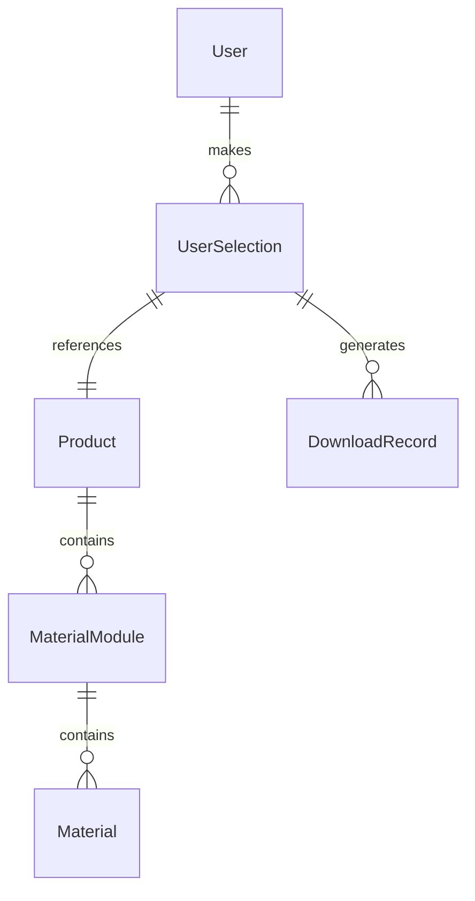

# 百变魔方数据模型设计

## 1. 商品模型 (Product)

```typescript
interface Product {
  id: string;                 // 商品ID
  name: string;              // 商品名称
  spuCode: string;           // SPU型号（唯一）
  gender: 'male' | 'female' | 'unisex';  // 人群性别
  ageRange: 'adult' | 'youth' | 'kids';  // 年龄区间
  scenarios: string[];       // 应用场景
  styles: string[];          // 场景风格
  designers: {
    threeDDesigner: string;  // 3D设计师
    graphicDesigner: string; // 平面设计师
  };
  createdAt: Date;          // 创建时间
  updatedAt: Date;          // 更新时间
  createdBy: string;        // 创建者ID
}
```

## 2. 素材模块模型 (MaterialModule)

```typescript
interface MaterialModule {
  id: string;               // 模块ID
  productId: string;        // 关联的商品ID
  type: ModuleType;         // 模块类型（主图/SKU/详情）
  subType: string;          // 子模块类型
  materials: Material[];    // 素材列表
  order: number;           // 排序顺序
  createdAt: Date;         // 创建时间
  updatedAt: Date;         // 更新时间
}

enum ModuleType {
  MAIN = 'main',           // 主图模块
  SKU = 'sku',            // SKU模块
  DETAIL = 'detail'       // 详情模块
}

interface Material {
  id: string;             // 素材ID
  url: string;            // 素材URL
  filename: string;       // 原始文件名
  filesize: number;       // 文件大小
  mimetype: string;       // 文件类型
  width: number;          // 图片宽度
  height: number;         // 图片高度
  order: number;         // 排序顺序
  createdAt: Date;       // 创建时间
}
```

## 3. 用户选择记录模型 (UserSelection)

```typescript
interface UserSelection {
  id: string;             // 选择记录ID
  userId: string;         // 用户ID
  productId: string;      // 商品ID
  selections: {           // 选择的素材
    moduleId: string;     // 模块ID
    materialId: string;   // 素材ID
  }[];
  createdAt: Date;       // 创建时间
  updatedAt: Date;       // 更新时间
}
```

## 4. 下载记录模型 (DownloadRecord)

```typescript
interface DownloadRecord {
  id: string;             // 下载记录ID
  userId: string;         // 用户ID
  productId: string;      // 商品ID
  selectionId: string;    // 选择记录ID
  downloadTime: Date;     // 下载时间
  downloadType: 'preview' | 'package';  // 下载类型
}
```

## 5. 数据关系图



## 6. 索引设计

### 6.1 Product 索引
- spuCode (唯一索引)
- gender + ageRange (复合索引)
- scenarios (多值索引)
- styles (多值索引)

### 6.2 MaterialModule 索引
- productId + type + subType (复合索引)
- order (索引)

### 6.3 Material 索引
- moduleId + order (复合索引)

### 6.4 UserSelection 索引
- userId + productId (复合索引)
- createdAt (索引)

## 7. 数据验证规则

### 7.1 Product 验证
- name: 必填，2-100字符
- spuCode: 必填，唯一，符合指定格式
- gender: 必填，枚举值
- ageRange: 必填，枚举值
- scenarios: 数组，至少一项
- styles: 数组，至少一项

### 7.2 Material 验证
- filename: 必填，符合命名规范
- filesize: 必填，限制最大值
- mimetype: 必填，限制类型
- width/height: 必填，限制范围 

## 8. 用户模型 (User)

```typescript
interface User {
  id: string;                // 用户ID
  username: string;          // 用户名
  email: string;            // 邮箱
  password: string;         // 加密密码
  role: UserRole;           // 用户角色
  permissions: string[];    // 权限列表
  lastLogin: Date;          // 最后登录时间
  status: UserStatus;       // 账号状态
  createdAt: Date;         // 创建时间
  updatedAt: Date;         // 更新时间
}

enum UserRole {
  ADMIN = 'admin',         // 管理员
  UPLOADER = 'uploader',   // 上传者
  VIEWER = 'viewer'        // 查看者
}

enum UserStatus {
  ACTIVE = 'active',       // 正常
  INACTIVE = 'inactive',   // 未激活
  BLOCKED = 'blocked'      // 已封禁
}
```

## 9. 操作日志模型 (OperationLog)

```typescript
interface OperationLog {
  id: string;              // 日志ID
  userId: string;          // 操作用户ID
  action: string;          // 操作类型
  targetType: string;      // 目标类型
  targetId: string;        // 目标ID
  details: {               // 操作详情
    before?: any;          // 操作前数据
    after?: any;          // 操作后数据
    reason?: string;      // 操作原因
  };
  ip: string;             // 操作IP
  userAgent: string;      // 用户代理
  timestamp: Date;        // 操作时间
}
```

### 9.1 操作日志索引
- userId + timestamp (复合索引)
- targetType + targetId (复合索引)
- action (索引) 